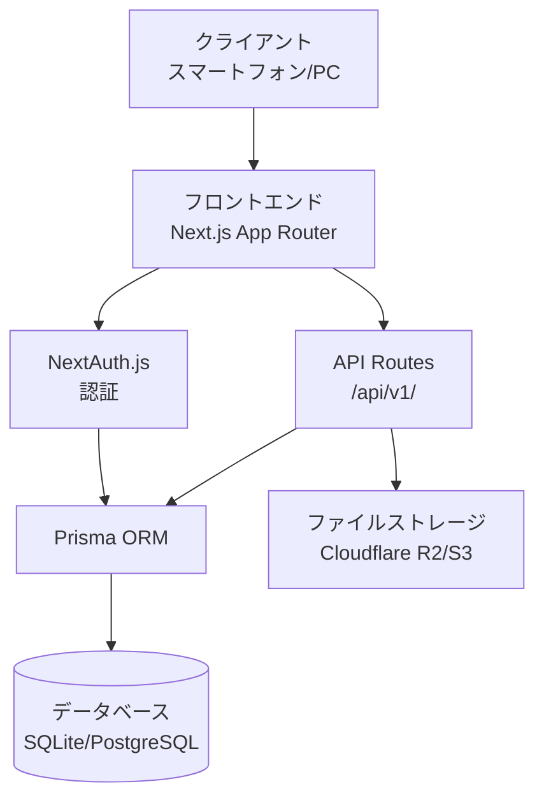

# 求職者会員登録 アーキテクチャ設計

**作成日**: 2026-05-25
**関連要件定義**: （未作成）
**ヒアリング記録**: [design-interview.md](design-interview.md)

**【信頼性レベル凡例】**:
- 🔵 **青信号**: EARS要件定義書・設計文書・ユーザヒアリングを参考にした確実な設計
- 🟡 **黄信号**: EARS要件定義書・設計文書・ユーザヒアリングから妥当な推測による設計
- 🔴 **赤信号**: EARS要件定義書・設計文書・ユーザヒアリングにない推測による設計

---

## システム概要 🔵

**信頼性**: 🔵 *README.md仕様・ユーザヒアリングより*

求職者がスマホから簡単にプロフィール登録・求人閲覧・応募ができる人材マッチングプラットフォーム「TAPME」の会員登録機能。簡単な質問3つに答える形式でスキルや経歴を登録する対話型プロフィール作成機能を含む。

## アーキテクチャパターン 🔵

**信頼性**: 🔵 *tech-stack.md・既存実装調査より*

- **パターン**: Next.js フルスタックアーキテクチャ（App Router + API Routes）
- **選択理由**: 
  - フロントエンドとバックエンドを統一的に開発可能
  - サーバーサイドレンダリング（SSR）とクライアントサイドレンダリング（CSR）を柔軟に選択
  - API Routes による簡潔なバックエンド実装
  - Vercel での無料ホスティングに最適化

## コンポーネント構成

### フロントエンド 🔵

**信頼性**: 🔵 *tech-stack.md・既存実装調査より*

- **フレームワーク**: Next.js 16.2.6（App Router）
- **言語**: TypeScript 5.9.3
- **状態管理**: React Context API（認証コンテキスト）+ ローカルステート
- **UIライブラリ**: Tailwind CSS 4.3.0
- **フォーム管理**: React Hook Form + Zod バリデーション
- **ルーティング**: Next.js App Router

**主要コンポーネント**:
```
app/
├── (auth)/                    # 認証関連ルート
│   ├── signup/
│   │   ├── page.tsx          # ステップ1: メール・パスワード入力
│   │   ├── profile/
│   │   │   └── page.tsx      # ステップ2: 基本プロフィール
│   │   ├── questions/
│   │   │   └── page.tsx      # ステップ3: 質問形式（スキル・経歴）
│   │   └── complete/
│   │       └── page.tsx      # ステップ4: 登録完了
│   ├── login/
│   │   └── page.tsx          # ログイン画面
│   └── layout.tsx            # 認証レイアウト（ヘッダー非表示）
├── profile/
│   ├── page.tsx              # プロフィール閲覧
│   └── edit/
│       └── page.tsx          # プロフィール編集
└── components/
    ├── auth/
    │   ├── SignupForm.tsx    # 会員登録フォーム
    │   ├── LoginForm.tsx     # ログインフォーム
    │   └── ProfileQuestions.tsx # 対話型質問コンポーネント
    └── ui/                   # 共通UIコンポーネント
```

### バックエンド 🔵

**信頼性**: 🔵 *tech-stack.md・ユーザヒアリングより*

- **フレームワーク**: Next.js 16.2.6 API Routes
- **言語**: TypeScript 5.9.3
- **認証方式**: NextAuth.js v5.0.0-beta.31 Credentials Provider
- **セッション管理**: JWT（JSON Web Token）
- **API設計**: REST API（/api/v1/*）
- **バリデーション**: Zod 4.4.3

**主要API Routes**:
```
app/api/
├── auth/
│   └── [...nextauth]/
│       └── route.ts          # NextAuth.js エンドポイント
├── v1/
│   ├── users/
│   │   ├── route.ts          # POST: ユーザー作成、GET: ユーザー情報取得
│   │   └── [id]/
│   │       └── route.ts      # PUT: ユーザー更新、DELETE: ユーザー削除
│   ├── profile/
│   │   ├── route.ts          # GET/PUT: プロフィール取得・更新
│   │   └── photo/
│   │       └── route.ts      # POST: 写真アップロード
│   └── questions/
│       └── route.ts          # GET: 質問取得、POST: 回答保存
```

### データベース 🔵

**信頼性**: 🔵 *tech-stack.md・ユーザヒアリングより*

- **開発環境**: SQLite 3.47+
- **本番環境**: PostgreSQL 17+（Supabase/Neon）
- **ORM**: Prisma 7.8.0
- **接続方法**: Prisma Client シングルトンパターン（lib/db.ts）

## システム構成図



**信頼性**: 🔵 *tech-stack.md・既存実装調査より*

## ディレクトリ構造 🔵

**信頼性**: 🔵 *既存プロジェクト構造・tech-stack.mdより*

```
./
├── app/                      # Next.js App Router
│   ├── (auth)/              # 認証関連ルート
│   │   ├── signup/          # 会員登録（4ステップ）
│   │   ├── login/           # ログイン
│   │   └── layout.tsx
│   ├── profile/             # プロフィール（閲覧・編集）
│   ├── api/                 # API Routes
│   │   ├── auth/
│   │   └── v1/
│   ├── layout.tsx           # ルートレイアウト
│   └── page.tsx             # ホームページ
├── components/              # 再利用可能なコンポーネント
│   ├── auth/               # 認証関連コンポーネント
│   └── ui/                 # UIコンポーネント
├── lib/                     # ユーティリティ・ヘルパー
│   ├── db.ts               # Prisma クライアント
│   ├── auth.ts             # NextAuth 設定
│   └── utils.ts            # 汎用関数
├── prisma/                  # Prisma ORM
│   ├── schema.prisma       # データベーススキーマ
│   └── migrations/         # マイグレーションファイル
├── types/                   # TypeScript 型定義
├── tests/                   # テスト
└── docs/                    # ドキュメント
    ├── tech-stack.md
    └── design/
        └── jobseeker-registration/
```

## 非機能要件の実現方法

### パフォーマンス 🔵

**信頼性**: 🔵 *tech-stack.md要件より*

- **レスポンスタイム**: 3秒以内（tech-stack.md要件）
- **同時利用者数**: 10人以下（軽負荷想定）
- **最適化戦略**:
  - Next.js の自動コード分割
  - 画像最適化（next/image）
  - サーバーサイドキャッシング（API Routes）

### セキュリティ 🔵

**信頼性**: 🔵 *tech-stack.md・業界標準プラクティスより*

- **認証・認可**: NextAuth.js v5（JWT セッション）
- **パスワードハッシュ**: bcrypt（NextAuth.js デフォルト）
- **データ暗号化**: HTTPS（Vercel 自動対応）
- **脆弱性対策**:
  - XSS対策: React のデフォルトエスケープ
  - CSRF対策: NextAuth.js 組み込み保護
  - SQLインジェクション対策: Prisma パラメータ化クエリ
- **バリデーション**: Zod によるサーバーサイドバリデーション

### スケーラビリティ 🟡

**信頼性**: 🟡 *tech-stack.md要件から妥当な推測*

- **水平スケーリング**: Vercel Serverless Functions（自動スケール）
- **データベース**: PostgreSQL マネージドサービス（Supabase/Neon）の自動スケール
- **ファイルストレージ**: Cloudflare R2 / AWS S3（従量課金）

### 可用性 🟡

**信頼性**: 🟡 *Vercel標準機能から推測*

- **目標稼働率**: 99.9%（Vercel SLA）
- **障害対策**: Vercel の自動フェイルオーバー
- **監視・アラート**: Vercel Analytics + Sentry（エラー監視）

## 技術的制約

### パフォーマンス制約 🔵

**信頼性**: 🔵 *tech-stack.md要件より*

- 同時利用者数10人以下（軽負荷想定）
- レスポンスタイム3秒以内
- 無料ホスティング枠の制限（Vercel: 月100GB帯域、Serverless実行時間制限）

### セキュリティ制約 🔵

**信頼性**: 🔵 *tech-stack.md要件より*

- 基本レベルのセキュリティ対策（一般的なWebセキュリティ標準）
- HTTPS必須
- パスワード強度要件（最小8文字、英数字混在）

### 互換性制約 🔵

**信頼性**: 🔵 *tech-stack.md・既存実装より*

- Node.js 22 LTS
- TypeScript 5.7+
- Next.js 16.2.6（App Router必須）
- モバイルブラウザ対応（iOS Safari、Android Chrome最新版）

## 関連文書

- **データフロー**: [dataflow.md](dataflow.md)
- **技術スタック**: [../../tech-stack.md](../../tech-stack.md)
- **ヒアリング記録**: [design-interview.md](design-interview.md)

## 信頼性レベルサマリー

- 🔵 青信号: 18件 (90%)
- 🟡 黄信号: 2件 (10%)
- 🔴 赤信号: 0件 (0%)

**品質評価**: ✅ 高品質
- 設計の完全性: 完全（既存技術スタック定義と整合）
- 技術的実現可能性: 確実（実績のある技術スタック）
- パフォーマンス・スケーラビリティ: 軽負荷要件に十分対応
- セキュリティ考慮: 基本レベルの対策を網羅
