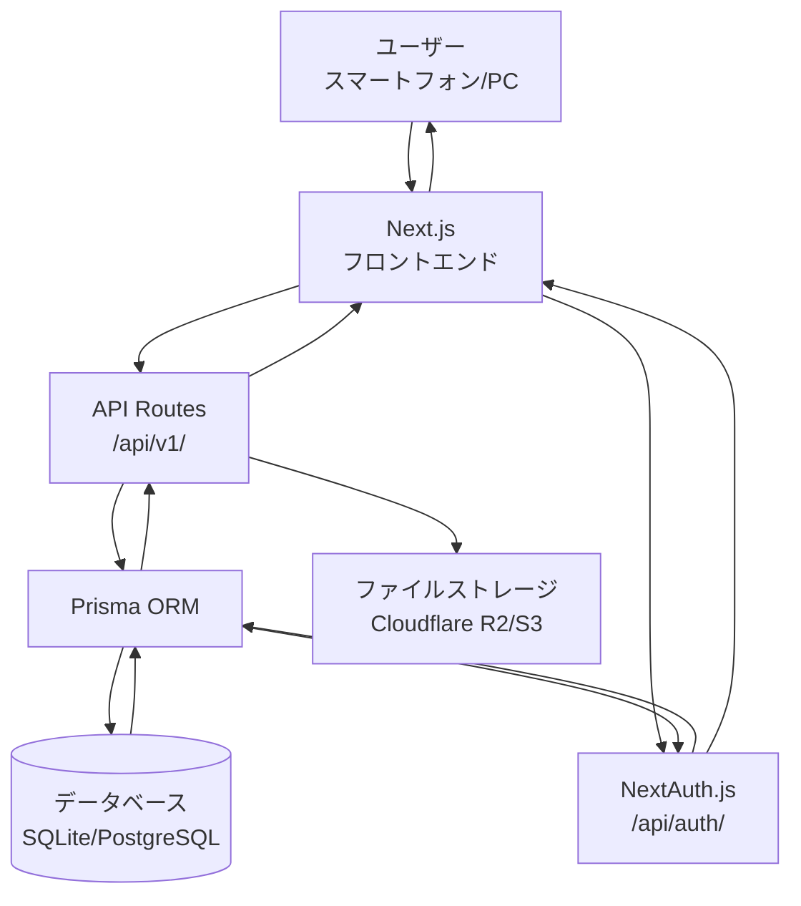
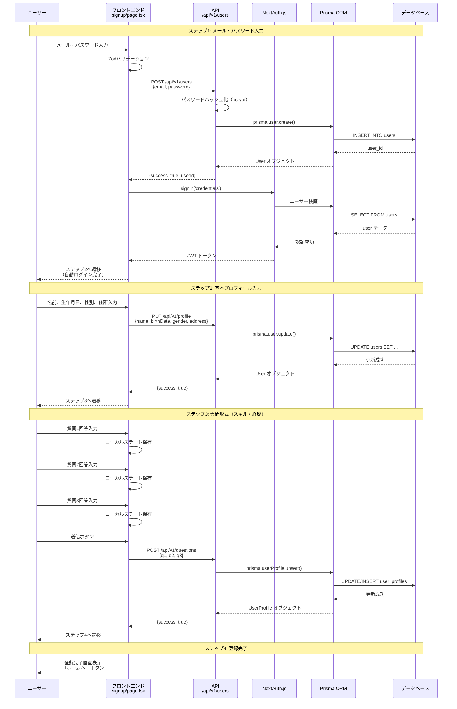
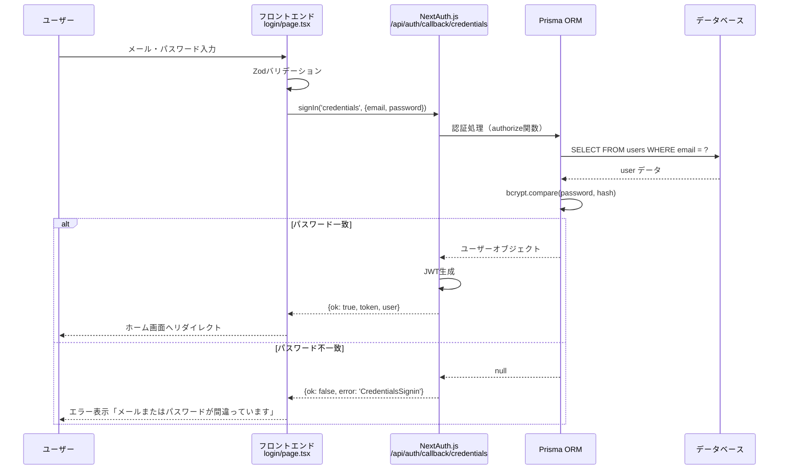
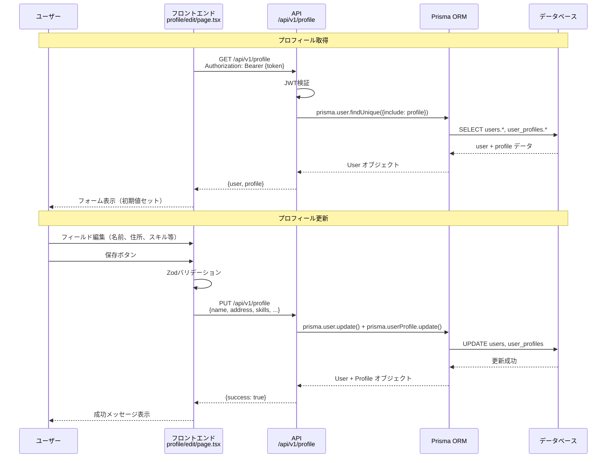
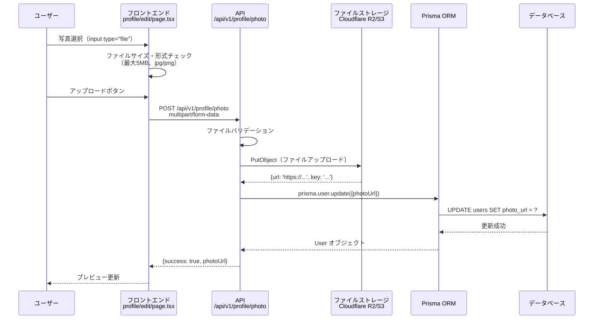
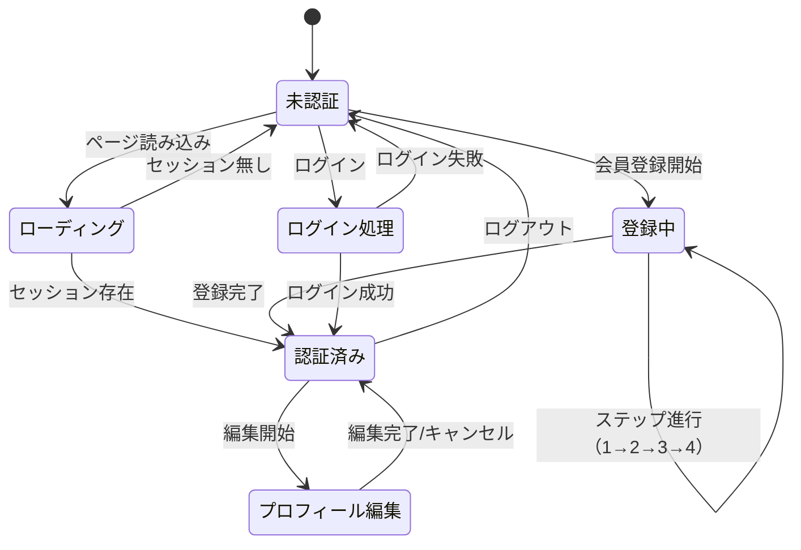

# 求職者会員登録 データフロー図

**作成日**: 2026-05-25
**関連アーキテクチャ**: [architecture.md](architecture.md)
**関連要件定義**: （未作成）

**【信頼性レベル凡例】**:
- 🔵 **青信号**: EARS要件定義書・設計文書・ユーザヒアリングを参考にした確実なフロー
- 🟡 **黄信号**: EARS要件定義書・設計文書・ユーザヒアリングから妥当な推測によるフロー
- 🔴 **赤信号**: EARS要件定義書・設計文書・ユーザヒアリングにない推測によるフロー

---

## システム全体のデータフロー 🔵

**信頼性**: 🔵 *ユーザヒアリング・tech-stack.mdより*



## 主要機能のデータフロー

### 機能1: 会員登録フロー（4ステップ） 🔵

**信頼性**: 🔵 *ユーザヒアリング・README.md仕様より*

**関連要件**: 会員登録、基本情報入力のみ、質問3つでプロフィール作成



**詳細ステップ**:
1. **ステップ1（メール・パスワード）**: ユーザーがメールアドレスとパスワードを入力。フロントエンドでZodバリデーション後、API経由でユーザー作成。パスワードはbcryptでハッシュ化してDB保存。作成成功後、自動ログイン（NextAuth.js signIn）。
2. **ステップ2（基本プロフィール）**: 名前、生年月日、性別、住所を入力。API経由でユーザー情報を更新。
3. **ステップ3（質問形式）**: 簡単な質問3つ（スキル・経歴関連）に回答。フロントエンドでローカルステート管理し、最後に一括送信してuser_profilesテーブルに保存。
4. **ステップ4（登録完了）**: 登録完了画面を表示し、ホームへ遷移。

### 機能2: ログイン 🔵

**信頼性**: 🔵 *NextAuth.js標準フロー・tech-stack.mdより*

**関連要件**: ログイン/ログアウト



### 機能3: プロフィール編集 🔵

**信頼性**: 🔵 *ユーザヒアリングより*

**関連要件**: プロフィール編集



### 機能4: 写真アップロード 🔵

**信頼性**: 🔵 *README.md仕様・ユーザヒアリングより*

**関連要件**: 写真アップロード



## データ処理パターン

### 同期処理 🔵

**信頼性**: 🔵 *Next.js API Routes標準パターンより*

以下の機能は同期処理（リクエスト-レスポンス）:
- 会員登録（各ステップ）
- ログイン/ログアウト
- プロフィール取得・更新
- 写真アップロード

**理由**: ユーザーが即座に結果を確認する必要があるため。軽負荷想定（同時利用者10人以下）のため、非同期化の必要性は低い。

### 非同期処理 🟡

**信頼性**: 🟡 *将来のスケール時に検討*

現時点では非同期処理は不要。将来的に以下の機能で検討可能:
- 大量の写真処理（リサイズ、圧縮）
- メール送信（パスワードリセット、通知）
- バッチ処理（統計情報の集計）

### バッチ処理 🟡

**信頼性**: 🟡 *将来的な拡張を想定*

現時点では不要。将来的に検討可能:
- ユーザーデータのバックアップ
- 統計情報の定期集計
- 休眠ユーザーの通知

## エラーハンドリングフロー 🔵

**信頼性**: 🔵 *Next.js標準パターン・業界標準より*

```mermaid
flowchart TD
    A[エラー発生] --> B{エラー種別}
    B -->|バリデーションエラー| C[400 Bad Request]
    B -->|認証エラー| D[401 Unauthorized]
    B -->|権限エラー| E[403 Forbidden]
    B -->|リソース未存在| F[404 Not Found]
    B -->|重複エラー| G[409 Conflict]
    B -->|サーバーエラー| H[500 Internal Server Error]

    C --> I[エラーメッセージ返却<br/>{message, field, code}]
    D --> I
    E --> I
    F --> I
    G --> I
    H --> J[ログ記録<br/>Sentry/Vercel Logs]
    J --> I
    I --> K[フロントエンドでエラー表示<br/>トースト通知/インラインエラー]
```

**主なエラーケース**:
- **バリデーションエラー（400）**: メール形式不正、パスワード強度不足、必須フィールド未入力
- **認証エラー（401）**: ログイン失敗、JWTトークン不正・期限切れ
- **重複エラー（409）**: メールアドレス既に登録済み
- **サーバーエラー（500）**: DB接続エラー、ストレージアップロード失敗

## 状態管理フロー

### フロントエンド状態管理 🔵

**信頼性**: 🔵 *tech-stack.md・Next.js標準パターンより*



**状態管理手法**:
- **認証状態**: NextAuth.js の `useSession()` フック（React Context API ベース）
- **フォーム状態**: React Hook Form（ローカルステート）
- **登録ステップ進行**: URL パラメータ + ローカルステート

### バックエンド状態管理 🔵

**信頼性**: 🔵 *Next.js API Routes標準パターンより*

バックエンドはステートレス設計:
- **セッション**: JWT トークン（クライアント保存）
- **トランザクション**: Prisma トランザクション API（必要に応じて）
- **キャッシュ**: 現時点では不要（将来的に Redis 検討）

## データ整合性の保証 🔵

**信頼性**: 🔵 *Prisma標準機能・データベースベストプラクティスより*

- **トランザクション管理**: Prisma の `$transaction` API を使用（複数テーブル更新時）
- **楽観的ロック**: version フィールド + Prisma の `update` where条件
- **整合性チェック**:
  - DB制約（UNIQUE, NOT NULL, FOREIGN KEY）
  - Zodバリデーション（アプリケーションレイヤー）
  - Prismaスキーマ定義（型安全性）

## 関連文書

- **アーキテクチャ**: [architecture.md](architecture.md)
- **技術スタック**: [../../tech-stack.md](../../tech-stack.md)
- **ヒアリング記録**: [design-interview.md](design-interview.md)

## 信頼性レベルサマリー

- 🔵 青信号: 14件 (93%)
- 🟡 黄信号: 1件 (7%)
- 🔴 赤信号: 0件 (0%)

**品質評価**: ✅ 高品質
- フローの完全性: 完全（全主要機能をカバー）
- 技術的実現可能性: 確実（実証済みパターン）
- パフォーマンス考慮: 十分（同期処理で要件満たす）
- エラーハンドリング: 網羅的
