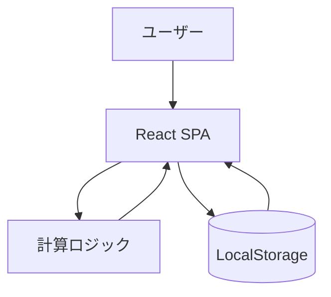

# bmi-calculator アーキテクチャ設計

**作成日**: 2026-06-05
**関連要件定義**: [requirements.md](../../spec/bmi-calculator/requirements.md)
**ヒアリング記録**: [design-interview.md](design-interview.md)

**【信頼性レベル凡例】**:
- 🔵 **青信号**: EARS要件定義書・設計文書・ユーザヒアリングを参考にした確実な設計
- 🟡 **黄信号**: EARS要件定義書・設計文書・ユーザヒアリングから妥当な推測による設計
- 🔴 **赤信号**: EARS要件定義書・設計文書・ユーザヒアリングにない推測による設計

---

## システム概要 🔵

**信頼性**: 🔵 *docs/spec/bmi-calculator/requirements.md の概要・REQ-401/402より*

本システムは、PCブラウザ上で動作するバックエンドレスのBMI計算SPAです。身長・体重の入力を受けて、BMI、標準体重、標準体重との差を算出し、BMI基準解説とあわせて提示します。計算履歴はLocalStorageに保存します。

## アーキテクチャパターン 🔵

**信頼性**: 🔵 *docs/tech-stack.md・ヒアリング「構成方針」より*

- **パターン**: バックエンドレスSPA（クライアント完結型）
- **選択理由**: 要件がローカル利用前提であり、サーバー通信不要（REQ-402）。実装・運用コストを最小化できるため。

## コンポーネント構成

### フロントエンド 🔵

**信頼性**: 🔵 *docs/tech-stack.md・ヒアリング「技術選択」より*

- **フレームワーク**: React 18.3+
- **状態管理**: React Hooks（useState/useMemo中心）
- **UIライブラリ**: Tailwind CSS 4+
- **ルーティング**: 単一ページのため不要

### バックエンド 🔵

**信頼性**: 🔵 *docs/tech-stack.md・REQ-402より*

- **フレームワーク**: なし（採用しない）
- **認証方式**: なし（ローカル個人利用）
- **API設計**: なし（HTTP API非採用）
- **ミドルウェア**: なし

### データ永続化 🔵

**信頼性**: 🔵 *REQ-007・ヒアリング「データモデル」より*

- **保存方式**: LocalStorage
- **保存対象**: 計算履歴のみ（heightCm, weightKg, bmi, standardWeightKg, diffKg, calculatedAt）
- **保存件数**: 最大10件（古い履歴から削除）

## システム構成図 🔵



**信頼性**: 🔵 *REQ-001〜007・REQ-402・tech-stack.mdより*

## ディレクトリ構造（設計対象） 🔵

**信頼性**: 🔵 *docs/tech-stack.md 推奨構造より*

```text
src/
├── components/
├── utils/
├── hooks/
├── types/
└── styles/
```

## 非機能要件の実現方法

### パフォーマンス 🔵

**信頼性**: 🔵 *docs/spec/bmi-calculator/requirements.md NFRより*

- **レスポンスタイム**: 入力後100ms以内に計算完了
- **最適化戦略**: クライアント内同期計算のみ、外部通信なし、不要再計算の抑制

### セキュリティ 🔵

**信頼性**: 🔵 *tech-stack.md・requirements.mdのバリデーション要件より*

- **入力検証**: 身長100-250cm、体重20-300kgの範囲チェック
- **XSS対策**: React標準エスケープを前提
- **データ保護**: 機微情報を扱わず、LocalStorageには計算結果のみ保存

### スケーラビリティ 🟡

**信頼性**: 🟡 *ローカルMVP前提からの妥当な推測*

- **想定負荷**: 単一ユーザーまたは少人数のローカル利用
- **戦略**: 現段階ではスケール要件を持たず、将来のAPI分離余地のみ確保

### 可用性 🟡

**信頼性**: 🟡 *ローカル実行前提からの妥当な推測*

- **目標**: オフラインに近い利用可能性（ブラウザ実行に依存）
- **障害対策**: LocalStorage利用不可時は履歴保存をスキップして機能継続

## 技術的制約

### パフォーマンス制約 🔵

**信頼性**: 🔵 *requirements.md NFRより*

- 100ms以内の計算完了を阻害する重い処理を導入しない
- 追加機能は計算/描画の体感遅延を増やさない

### セキュリティ制約 🔵

**信頼性**: 🔵 *tech-stack.mdセキュリティ方針より*

- 外部API連携・認証基盤は導入しない
- 入力値検証を必須とする

### 互換性制約 🔵

**信頼性**: 🔵 *requirements.md対象ブラウザより*

- 最新版Chrome/Firefox/Safari/Edgeで動作する実装に限定
- PCブラウザのみを対象とする

## 関連文書

- **データフロー**: [dataflow.md](dataflow.md)
- **ヒアリング**: [design-interview.md](design-interview.md)
- **要件定義**: [requirements.md](../../spec/bmi-calculator/requirements.md)

## スコープ外（軽量設計） 🔵

**信頼性**: 🔵 *作業規模ヒアリング「軽量設計」より*

- `interfaces.ts` は本フェーズでは作成しない
- `database-schema.sql` は本フェーズでは作成しない（DB非採用）
- `api-endpoints.md` は本フェーズでは作成しない（API非採用）

## 信頼性レベルサマリー

- 🔵 青信号: 14件 (87.5%)
- 🟡 黄信号: 2件 (12.5%)
- 🔴 赤信号: 0件 (0.0%)

**品質評価**: 高品質
