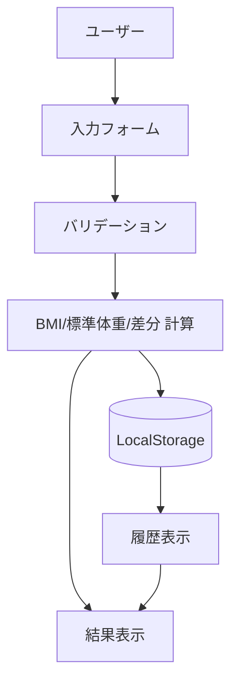
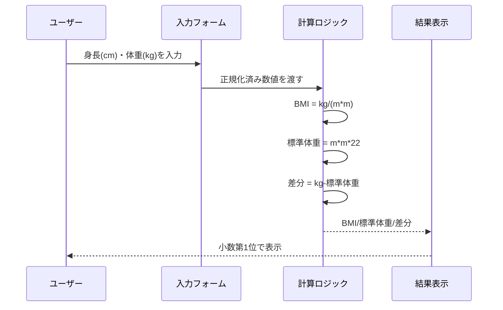
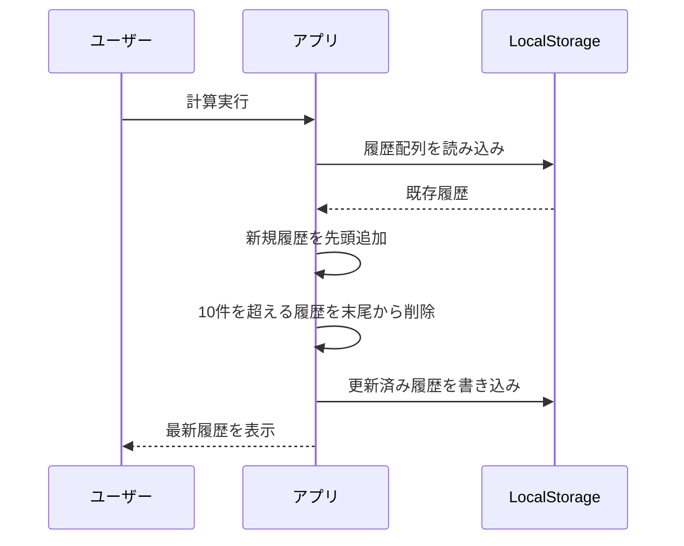
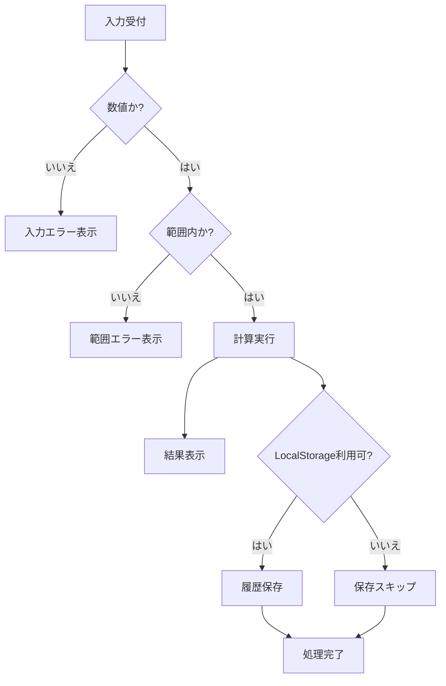
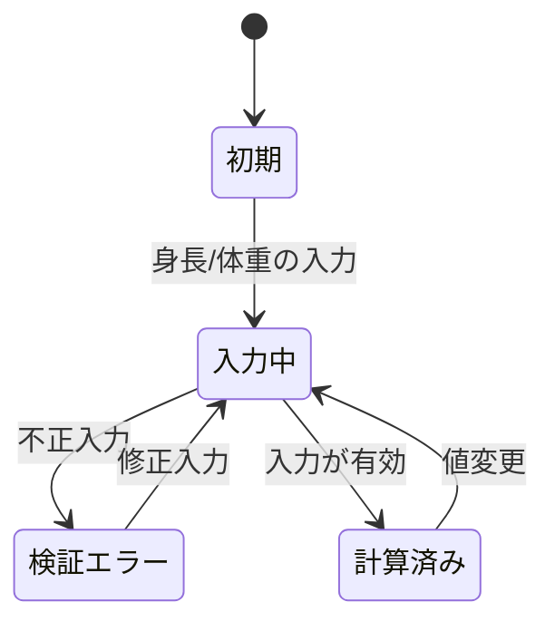

# bmi-calculator データフロー図

**作成日**: 2026-06-05
**関連アーキテクチャ**: [architecture.md](architecture.md)
**関連要件定義**: [requirements.md](../../spec/bmi-calculator/requirements.md)

**【信頼性レベル凡例】**:
- 🔵 **青信号**: EARS要件定義書・設計文書・ユーザヒアリングを参考にした確実なフロー
- 🟡 **黄信号**: EARS要件定義書・設計文書・ユーザヒアリングから妥当な推測によるフロー
- 🔴 **赤信号**: EARS要件定義書・設計文書・ユーザヒアリングにない推測によるフロー

---

## システム全体のデータフロー 🔵

**信頼性**: 🔵 *REQ-001〜007・REQ-402・tech-stack.mdより*

## 主要機能のデータフロー

### 機能1: BMI/標準体重/差分の計算 🔵

**信頼性**: 🔵 *REQ-003/005/006・受け入れ基準より*

**関連要件**: REQ-003, REQ-005, REQ-006

**詳細ステップ**:
1. 入力値を数値変換し、範囲チェックする。
2. 身長をmに変換してBMIと標準体重を計算する。
3. 現在体重との差分とBMI判定を画面に反映する。

### 機能2: 計算履歴の保存/復元 🔵

**信頼性**: 🔵 *REQ-007・ヒアリング「データモデル」より*

**関連要件**: REQ-007

**備考**: LocalStorageが利用不可の場合は保存処理をスキップして計算結果表示を継続する。🟡 *異常時継続方針は実装観点の推測*

## データ処理パターン

### 同期処理 🔵

**信頼性**: 🔵 *要件の計算仕様より*

入力変更時の計算、判定、表示更新は全て同期処理で完結する。

### 非同期処理 🟡

**信頼性**: 🟡 *将来拡張の妥当な推測*

現時点で非同期API処理は不要。将来、履歴エクスポート等を追加する場合のみ非同期化を検討する。

### バッチ処理 🔵

**信頼性**: 🔵 *要件より*

バッチ処理は採用しない（単発計算UI）。

## エラーハンドリングフロー 🔵

**信頼性**: 🔵 *受け入れ基準・入力制約より*

## 状態管理フロー

### フロントエンド状態管理 🔵

**信頼性**: 🔵 *tech-stack.md・ヒアリング「React Hooks中心」より*

## データ整合性の保証 🔵

**信頼性**: 🔵 *REQ-007・ヒアリング「計算履歴のみ」より*

- **整合性単位**: 1回の計算結果を1履歴レコードとして保存
- **上限制御**: 配列長を10件に制限
- **保存形式**: JSON文字列化し、読み出し時にスキーマ互換を確認

## 関連文書

- **アーキテクチャ**: [architecture.md](architecture.md)
- **ヒアリング**: [design-interview.md](design-interview.md)

## 信頼性レベルサマリー

- 🔵 青信号: 9件 (81.8%)
- 🟡 黄信号: 2件 (18.2%)
- 🔴 赤信号: 0件 (0.0%)

**品質評価**: 高品質
